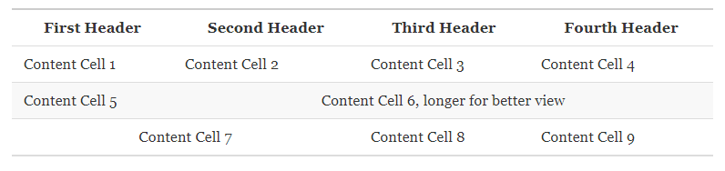

Xtable
===============

## install

```
devtools::install_github("6Youcai/Xtable")
```

## Tables
    
common tables can be generated by markdown like this:

```
First Header  | Second Header
------------- | -------------
Content Cell  | Content Cell
Content Cell  | Content Cell
```

## rowspan

I defined `$v2;` for a cell than spans to the down for two rows;

```
\```{r, echo=FALSE, results='asis'}
library(Xtable)
text <- "First Header  | Second Header | Third Header
------------- | ------------- | ------------
$v2;Content Cell 1 | Content Cell 2 | Content Cell 3
Content Cell 4 | Content Cell 5  
"
Xtable::Mtable(text)
\```
```

in R markdown, these code will generate


## colspan

similarly, `$>3;` means a cell that spans to the right for three cols.

```
\```{r, echo=FALSE, results='asis'}
text <- "
First Header  | Second Header | Third Header | Fourth Header
------------- | ------------- | ------------ | -------------  
Content Cell 1 | Content Cell 2 | Content Cell 3 | Content Cell 4
Content Cell 5 |$>3;Content Cell 6
$>2;Content Cell 7| Content Cell 8| Content Cell 9
"
Mtable(text)
\```
```



## mixed

```
\```{r, echo=FALSE, results='asis'}
text <- "
Content Cell 1 | Content Cell 2  | Content Cell 3 | Content Cell 4 | Content Cell 5
Content Cell 6  | $v2;$>2;Content Cell  7 | Content Cell 8
Content Cell  9| Content Cell  10| Content Cell 11
Content Cell 12 | Content Cell  13| Content Cell 14| Content Cell 15 
Content Cell  16| Content Cell  17| $>3;Content Cell 18 
"
Mtable(text)
\```
```


